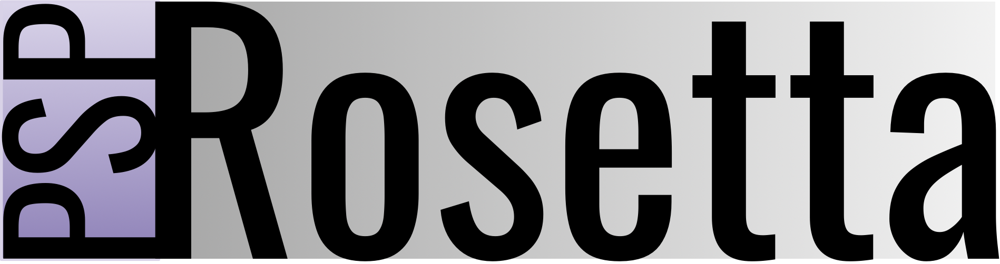

<p align="center">
  
</p>

# PSP-Rosetta

Re-targeting old browser games to homebrew / custom-firmware PSP.

Two concrete targets, sharing one pipeline:

| Game | Original tech | Source situation | Difficulty |
|---|---|---|---|
| **Luftrauser** (Vlambeer, 2011) | Flash / ActionScript 3, 2D | No public source — decompile the SWF | Small: one screen, 2D, simple physics. **Starting here.** |
| **Need for Madness?** (Omar Waly / Radical Play, 2005) | Java applet, custom software 3D renderer | Source released / decompiled trees exist (e.g. `catb0t/need-for-madness-source`) | Large: 3D, AI, replay system, ~15 cars, many stages |

There is no "recompile" for either. Flash bytecode targets the AVM2 VM + Flash display
stack; Java targets the JVM. Neither exists on PSP. The real work is **extract assets ->
reimplement game logic in C/C++ against the PSP SDK**. This repo automates the asset half
and scaffolds the code half.

---

## Target platform

- PSP (any model) running CFW: ARK-4 / PRO / Adrenaline (PS Vita).
- Output: unsigned `EBOOT.PBP`, built with the `pspdev` SDK (`psp-gcc`, MIPS).
- Screen: **480x272**. Both originals render larger and must be rescaled / re-laid-out.
- ~32 MB usable RAM (64 on PSP-2000+). GPU: fixed-function GU with hardware T&L.
- Iterate in **PPSSPP** (headless mode for CI), then verify on hardware.

---

## Architecture

```
                 +-------------+
  game source    |  ADAPTER    |   game-specific front-end
  (SWF export /  |  flash /    |   -> emits a common Intermediate
   Java tree)    |  java       |      Representation (IR) + manifest
                 +------+------+
                        |  IR assets: image | audio | mesh | font | data
                 +------v------+
                 |  CONVERT    |   game-agnostic PSP-native encoders
                 |  textures / |   -> .ptx (POT, swizzled, paletted)
                 |  audio /    |   -> .pcm / .ogg / (.vag TODO)
                 |  models     |   -> runtime mesh (NFM)
                 +------+------+
                 +------v------+
                 |  PACK       |   -> assets.pak (TOC archive) + manifest
                 +-------------+
                        |
                 +------v------------------------------+
                 |  RUNTIME (C/C++, separate effort)   |
                 |  engine abstraction: 3 backends     |
                 |   - software (parity/debug)         |
                 |   - pspgu    (hardware, real target)|
                 |   - sdl      (desktop fast-iterate) |
                 +------------------------------------+
```

### The abstraction that makes two games one project

Everything game-specific lives in an **Adapter** (`pipeline/adapters/`). Adapters only
*discover and describe* assets; they never encode anything PSP-specific. The IR
(`pipeline/ir.py`) is the contract. Downstream converters and the eventual runtime only
ever see IR, so adding a third game = one new adapter.

---

## Asset pipeline stages

1. **crawl** — run an adapter over a source dir, classify every asset, emit `manifest.json`.
2. **convert** — encode each IR asset to a PSP-native format per the game's `game.toml`.
3. **pack** — bundle converted files into `assets.pak` + a runtime manifest.

CLI: `psp-rosetta <crawl|convert|pack|info> ...` (see `README.md`).

### Formats

- **Textures -> `.ptx`** (custom container): power-of-two, optional PSP swizzle
  (16x8 byte blocks), formats RGBA8888 / RGBA5551 / RGBA4444 / IDX8+palette.
- **Audio**: SFX -> raw PCM s16le at a reduced sample rate; music -> Ogg Vorbis
  (PSP has a vorbis port). `.vag` (Sony ADPCM) is **TODO** — needs a standalone encoder.
- **Meshes** (NFM only) -> flat vertex/index buffers + precomputed GU display lists. Stubbed.

---

## Code-port half (not built yet — design only)

- **Flash / Luftrauser**: JPEXS CLI dumps AS3; rewrite by hand in C++ (small enough).
  Assets come through this pipeline.
- **Java / NFM**: API-surface scanner -> transpiler (j2c / JTransc / LLM-assisted per file)
  -> `java.*` runtime shim (collections->STL, `Graphics`->render interface, applet->main
  loop, `Thread`->pspThread, IO->sceIo, bit-exact `Math`/RNG for replay determinism).

### Verification harness (design)

- **Replay oracle (NFM)**: NFM's deterministic replay system is the regression detector.
  Run recorded replays through original Java (headless) and the C++ port; diff car state
  (pos / vel / damage) frame-by-frame.
- **Golden screenshots**: PPSSPP headless screenshot dumps, perceptual-diff vs the
  software backend.
- **Perf/memory**: FPS + heap logging; CI fails if a stage blows the 32 MB budget.

---

## Status

- [x] Project scaffold, IR, manifest schema
- [x] Flash adapter (JPEXS export dir -> IR)
- [x] Texture converter (`.ptx`: POT, swizzle, 4 formats)
- [x] Audio converter (PCM / Ogg via ffmpeg)
- [x] Pack archive + CLI + synthetic Luftrauser fixture + tests
- [ ] Real Luftrauser SWF: obtain, JPEXS-export, run pipeline for real
- [ ] Java/NFM adapter (walks source tree — stubbed)
- [ ] Mesh converter
- [ ] `.vag` audio encoder
- [ ] Runtime skeleton (pspdev CMake toolchain, EBOOT packaging)
- [ ] Engine abstraction + 3 backends
- [ ] Verification harness

---

## Legal

Personal use, on hardware you own. Don't redistribute EBOOTs bundling Vlambeer's or
Radical Play's assets. This repo contains **no** game assets — only tooling and a
synthetic fixture.
