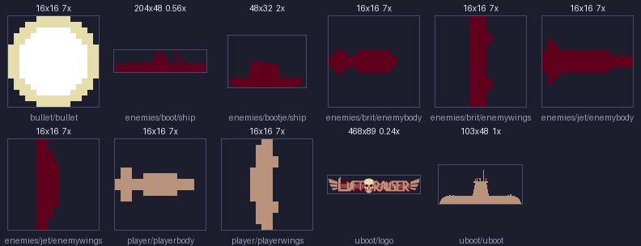
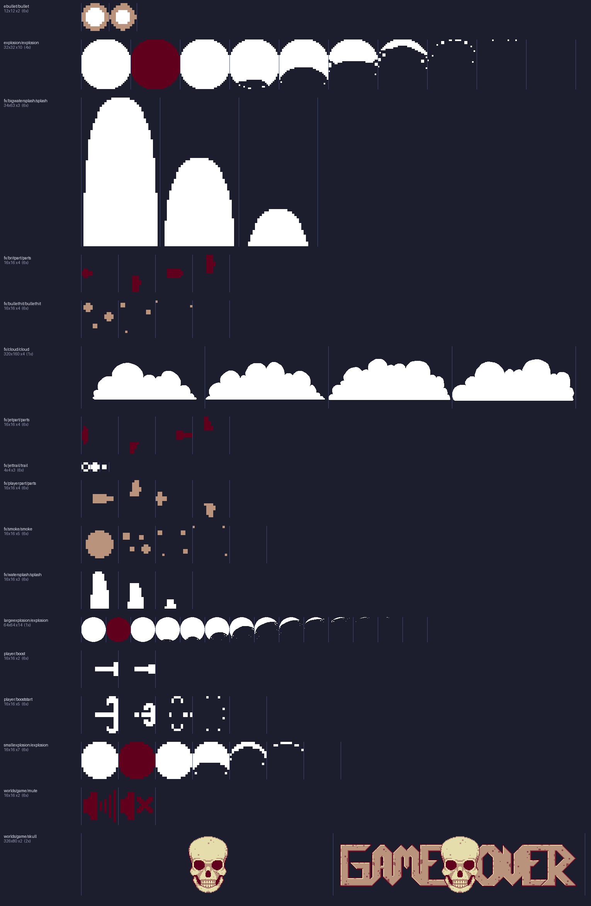

# Luftrauser assets — what came out of the SWF

47 assets extracted from `luftrauser_real.swf` (after MochiCrypt unwrap) and run
through the pipeline: **30 sprites, 17 sounds** (16 SFX + 1 music). No vector
shapes, no bitmap fonts kept (the FlashPunk debug console font is excluded).

Regenerate: `python -m pipeline.cli build --game luftrauser --src sources/luftrauser/assets`
→ `build/luftrauser/assets.pak` (~2.1 MB) + `assets.manifest.json`.

## Previews

Composited on the game's navy and scaled nearest-neighbour. Regenerate with
`.venv/bin/python tools/render_asset_preview.py`.

**Single-frame sprites** — planes/ships/bullets drawn as one (runtime-rotated) quad:

**Animation strips** — vertical bars mark the `Spritemap` frame cells:

The white ring → dark-red flash → collapsing crescent is the signature Vlambeer
explosion (`explosion/explosion`, 10 frames). Player art is tan/skin-toned, enemy
art is dark red `#61001D`, FX are white — the runtime recolours per palette.

`src` = pixels in the SWF · `frame` = FlashPunk `Spritemap` cell (the animation
frame size) · `n` = frame count · `.ptx` = what the pipeline emitted (POT, RGBA5551,
swizzled).

## Player  (`Interaction/Player.as`)

| asset id | src | frame · n | notes |
|---|---|---|---|
| `image/interaction/player/playerbody` | 16×16 | single | the hull; **runtime-rotated** about center by nose angle |
| `image/interaction/player/playerwings` | 16×16 | single | drawn as a 2nd rotated sprite; `scaleY = sin(angle)` for the bank/roll squash |
| `image/interaction/player/boost` | 32×16 | 16×16 · 2 | thruster flame loop while holding UP |
| `image/interaction/player/booststart` | 80×16 | 16×16 · 5 | one-shot flare when thrust engages |

Hitbox is a fixed **4×4 AABB** — it does not rotate with the sprite.

## Enemies  (`Interaction/Enemies/`)

| asset id | src | frame · n | unit | notes |
|---|---|---|---|---|
| `image/interaction/enemies/brit/enemybody` | 16×16 | single | AIR | the staple plane; body + wings, rotated at runtime like the player |
| `image/interaction/enemies/brit/enemywings` | 16×16 | single | AIR | |
| `image/interaction/enemies/jet/enemybody` | 16×16 | single | AIR | fast interceptor |
| `image/interaction/enemies/jet/enemywings` | 16×16 | single | AIR | leaves a `JetTrail` every frame |
| `image/interaction/enemies/boot/ship` | 204×48 | single | SEA | the battleship ("SHIP"), score 100 |
| `image/interaction/enemies/bootje/ship` | 48×32 | single | SEA | the small boat ("BOAT"), score 40 |
| `image/interaction/uboot/uboot` | 103×48 | single | SEA | the submarine — attract-mode launcher, proto-boss |
| `image/interaction/uboot/logo` | 468×89 | single | — | "LUFTRAUSER" title art on the sub's sail |

## Bullets

| asset id | src | frame · n | notes |
|---|---|---|---|
| `image/interaction/bullet/bullet` | 16×16 | single | **player** bullet, speed 16, 1 every 4 frames |
| `image/interaction/ebullet/bullet` | 24×12 | 12×12 · 2 | **enemy** bullet (`EBullet`) |

## FX / particles  (`Interaction/FX/`, `Interaction/*Explosion.as`)

| asset id | src | frame · n | trigger |
|---|---|---|---|
| `image/interaction/explosion/explosion` | 320×32 | 32×32 · 10 | generic enemy death |
| `image/interaction/smallexplosion/explosion` | 112×16 | 16×16 · 7 | small hits |
| `image/interaction/largeexplosion/explosion` | 896×64 | 64×64 · 14 | player death / battleship — **sheet >512px, see limitation below** |
| `image/interaction/fx/bullethit/bullethit` | 64×16 | 16×16 · 4 | bullet strikes something |
| `image/interaction/fx/smoke/smoke` | 80×16 | 16×16 · 5 | damaged / dying trails |
| `image/interaction/fx/jettrail/trail` | 12×4 | 4×4 · 3 | Jet motion trail (one entity/frame) |
| `image/interaction/fx/playerpart/parts` | 64×16 | 16×16 · 4 | player debris |
| `image/interaction/fx/britpart/parts` | 64×16 | 16×16 · 4 | Brit debris |
| `image/interaction/fx/jetpart/parts` | 64×16 | 16×16 · 4 | Jet debris |
| `image/interaction/fx/watersplash/splash` | 48×16 | 16×16 · 3 | small water entry |
| `image/interaction/fx/bigwatersplash/splash` | 102×64 | 34×63 · 3 | large water entry |
| `image/interaction/fx/cloud/cloud` | 1280×160 | 320×160 · 4 | parallax clouds — **sheet >512px, see below** |

## World bands  (`Interaction/Water.as`, `Space.as`)

| asset id | src | frame | notes |
|---|---|---|---|
| `image/interaction/water/water` | 32×240 | `TiledImage(800,240)` | horizontal band, `water.y = 640` world |
| `image/interaction/space/space` | 32×240 | `TiledImage(800,240)` | band at `space.y ≈ -240` world |

## UI  (`Worlds/Game.as`)

| asset id | src | frame · n | notes |
|---|---|---|---|
| `image/worlds/game/skull` | 652×80 | 326×80 · 2 | game-over skull drop — **sheet >512px, see below** |
| `image/worlds/game/mute` | 32×16 | 16×16 · 2 | mute toggle, mouse hit-tested |

There is **no HUD sprite** — score/high-score/game-over text is rendered with the
FlashPunk `Text` class (embedded 5px pixel TTF, rebuilt every frame). The port
replaces this with a glyph-atlas bitmap-font blitter — a new asset we author, not
one from the SWF. See `docs/flashpunk-api-surface.md` §7.

## Audio

16 SFX (MP3 in the SWF → decoded to headerless **PCM s16le mono @ 22 050 Hz** for
`sceAudio`) + 1 looping music track (kept as **MP3** for the PSP hardware decoder).

| asset id | length | event (`docs/luftrauser-port-spec.md` §9) |
|---|--:|---|
| `audio/interaction/player/sndshoot` | 0.05 s | every player shot |
| `audio/interaction/player/sndspawn` | 0.85 s | launch from the sub |
| `audio/interaction/player/sndboost` | 1.08 s | thrust held (loop-ish) |
| `audio/interaction/player/sndboostleave` | 0.33 s | thrust released |
| `audio/interaction/bullet/snd` | 0.18 s | player bullet spawn |
| `audio/interaction/ebullet/snd` | 0.16 s | enemy bullet spawn |
| `audio/interaction/enemies/brit/snd` · `snd2` | 0.18 / 0.16 s | Brit fire / death |
| `audio/interaction/enemies/jet/snd` | 0.68 s | Jet |
| `audio/interaction/enemies/boot/snd` · `snd2` | 2.30 / 0.17 s | battleship horn / hit |
| `audio/interaction/enemies/bootje/snd` · `snd2` | 0.55 / 0.17 s | boat |
| `audio/interaction/explosion/snd` | 0.42 s | generic explosion |
| `audio/interaction/smallexplosion/snd` | 0.35 s | small explosion |
| `audio/interaction/largeexplosion/snd` | 1.27 s | player death / big kill |
| `audio/worlds/game/music` | 129.6 s | looping BGM (by KOZILEK), starts on launch |

SFX PCM total ≈ 380 KiB; music MP3 ≈ 1.27 MB.

## Animation sheets → atlases

The 17 sheets listed in `games/luftrauser/game.toml` `[convert.textures.sheets]`
(each with its `new Spritemap(cls, fw, fh)` cell size) are sliced into frames and
repacked into one power-of-two atlas ≤ 512×512. Each manifest record carries
`frame_w/frame_h/frame_count/atlas_cols/atlas_rows` and a `frames` list of
`[x, y, w, h]` rects for runtime UVs.

`largeexplosion` (896px → 512×128, 8×2) and `skull` (652px → 512×256) pack at
native size. **Only `cloud`** can't fit at native size (4 × 320×160 would need
512×1024) so its frames are uniformly downscaled to 256×128 (`frame_scale 0.8`) —
fine for a background parallax layer. Everything else is `frame_scale 1.0`.

`water`/`space` are **not** sheets — 32×240 single textures the runtime tiles via
`TiledImage(800, 240)`; listed under `[convert.textures] tiled`.
